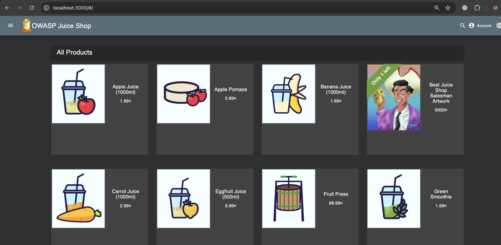
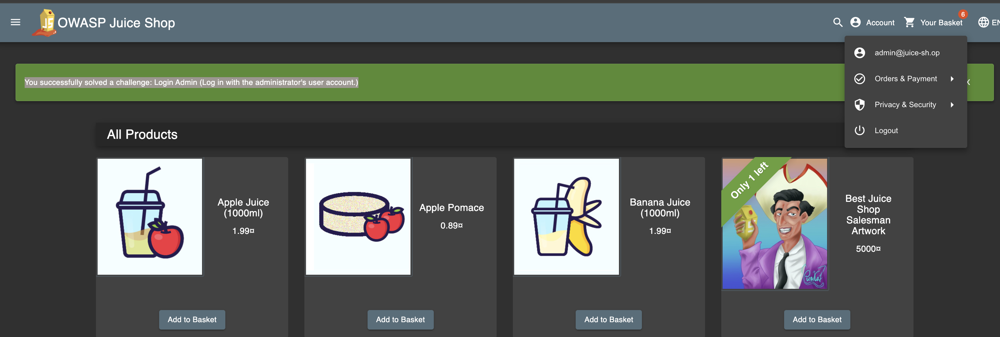
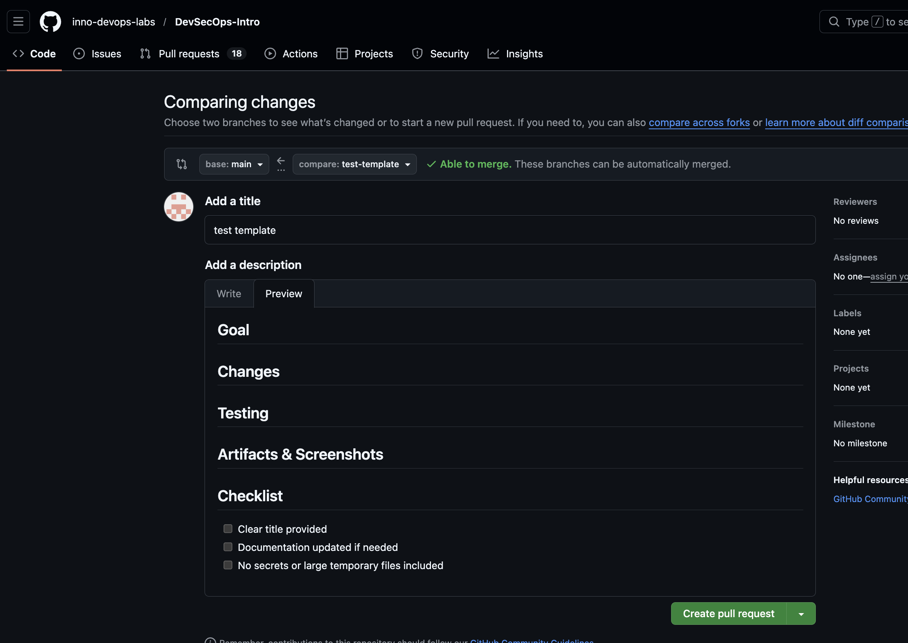
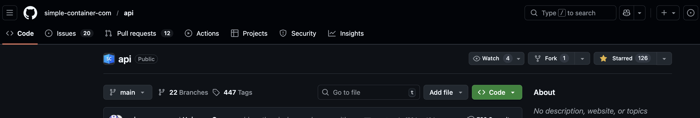
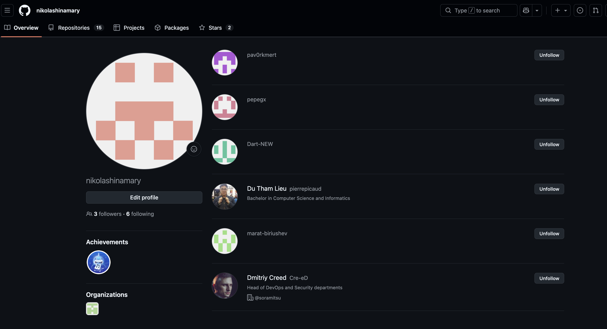

# Triage Report — OWASP Juice Shop

## Scope & Asset
- Asset: OWASP Juice Shop (local lab instance)
- Image: bkimminich/juice-shop:v19.0.0
- Release link/date: <https://github.com/juice-shop/juice-shop/releases/tag/v19.0.0> — <Sep 4, 2025>
- Image digest (optional): <sha256:2765a26de7647609099a338d5b7f61085d95903c8703bb70f03fcc4b12f0818d>

## Environment
- Host OS: macOS 14.5
- Docker: version 26.1.3, build b72abbb6f0

## Deployment Details
- Run command used: `docker run -d --name juice-shop -p 127.0.0.1:3000:3000 bkimminich/juice-shop:v19.0.0`
- Access URL: http://127.0.0.1:3000
- Network exposure: 127.0.0.1 only [X] Yes  [ ] No  (explain if No)

## Health Check
- Page load: attach screenshot of home page (path or embed)

- API check: first 5–10 lines from `curl -s http://127.0.0.1:3000/rest/products | head`

```
marianikolashina@MacOs DevSecOps-Intro % curl -s http://127.0.0.1:3000/rest/products | head
<html>
  <head>
    <meta charset='utf-8'> 
    <title>Error: Unexpected path: /rest/products</title>
    <style>* {
  margin: 0;
  padding: 0;
  outline: 0;
}
```

## Surface Snapshot (Triage)
- Login/Registration visible: [X] Yes  [ ] No — Yes, in right top corner hidden by Account button
- Product listing/search present: [X] Yes  [ ] No — Clearly visible also in right top corner
- Admin or account area discoverable: [X] Yes  [ ] No — Account area discoverable, admin panel is hidden/not visible
- Client-side errors in console: [ ] Yes  [X] No — No errors found in console
- Security headers (quick look — optional): `curl -I http://127.0.0.1:3000` → CSP/HSTS present?  - Not present
```
marianikolashina@MacOs DevSecOps-Intro % curl -I http://127.0.0.1:3000
HTTP/1.1 200 OK
Access-Control-Allow-Origin: *
X-Content-Type-Options: nosniff
X-Frame-Options: SAMEORIGIN
Feature-Policy: payment 'self'
X-Recruiting: /#/jobs
Accept-Ranges: bytes
Cache-Control: public, max-age=0
Last-Modified: Sun, 08 Feb 2026 09:52:01 GMT
ETag: W/"124fa-19c3caa5269"
Content-Type: text/html; charset=UTF-8
Content-Length: 75002
Vary: Accept-Encoding
Date: Sun, 08 Feb 2026 10:28:39 GMT
Connection: keep-alive
Keep-Alive: timeout=5
```

## Risks Observed (Top 3)
1) Vulnerability on login endpoint allowing to login with invalid password and SQL Injection

2) Absence of security headers - Missing security headers exposes your web application to critical client-side vulnerabilities, such as XSS and etc
3) Excessively permissive CORS policy like Access-Control-Allow-Origin: * exposes data to theft by other sites, allowing malicious websites to make API calls and steal credentials from browser cookies.

# PR Template Setup

## Template Creation
- File created: `.github/pull_request_template.md`
- Steps taken: Created the file in `.github/` with sections (Goal, Changes, Testing, Artifacts & Screenshots) and a 3‑item checklist.

## Template Verification
- Evidence that PR auto-filled:
  - 
- Filled sections in PR:
  - Goal: Document Lab 1 submission and PR template setup
  - Changes: Added `labs/submission1.md` and PR template
  - Testing: Not run (documentation only)
  - Artifacts & Screenshots: Linked Juice Shop home screenshot and PR template screenshot
- Checklist items checked: Title clear, docs updated, no secrets/large temp files

## PR Commitments
- `docs: add PR template` (main branch)
- `docs(lab1): add submission1 triage report` (feature/lab1 branch)
- PR branch: `feature/lab1` → `main`

## Workflow Impact
- A PR template standardizes what reviewers see, reduces back‑and‑forth, and ensures key checks and artifacts are consistently included. It makes lab submissions faster to review and easier to verify.

# GitHub Community
- Why stars matter: Stars help signal project usefulness, increase visibility, and provide social proof that attracts contributors.
- Why following developers helps: Following classmates and maintainers helps discover projects, learn from their activity, and supports collaboration.



