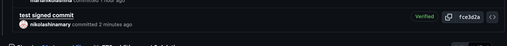
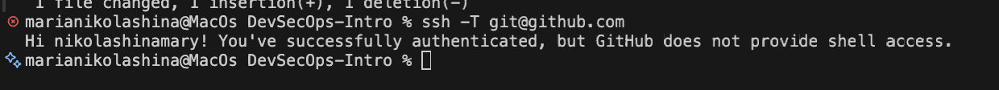
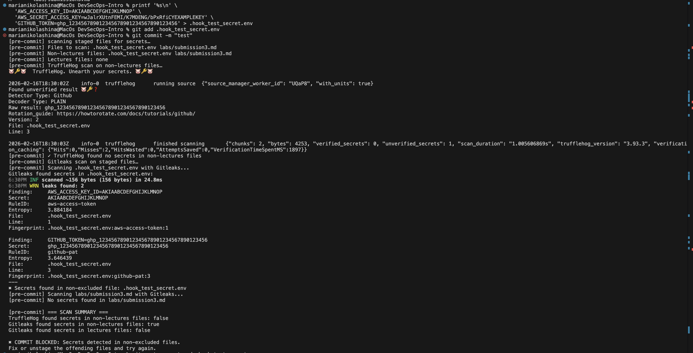
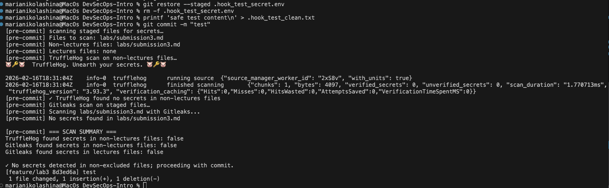

# Lab 3 Submission - Secure Git

This report includes all required sections for Lab 3 Task 1 and Task 2, with evidence and analysis.

## Task 1 - SSH Commit Signature Verification

### 1.1 Required section: Benefits of commit signing

Description: This section explains why commit signing improves repository security.

- Commit signing proves authorship and protects commit integrity.
- It reduces spoofed or impersonated commits in team repositories.
- It improves auditability in code review and CI/CD workflows.
- It supports branch rules that require trusted, verified commits before merge.

### 1.2 Required section: SSH key setup and Git signing configuration evidence

Description: This section shows the local Git configuration used for SSH-based commit signing.

Commands used:

```bash
git config --get user.signingkey
git config --get gpg.format
git config --get commit.gpgsign
```

Observed values:

```text
/Users/marianikolashina/.ssh/id_rsa.pub
ssh
true
```

### 1.3 Required section: Signed commit and GitHub Verified badge evidence

Description: This section provides signed-commit proof and visual verification evidence.

- Signed commit in repo history:
  [`fce3d2a75b50f6dc97a410a9f368d6623133ff87`](https://github.com/nikolashinamary/DevSecOps-Intro/commit/fce3d2a75b50f6dc97a410a9f368d6623133ff87)
- GitHub Verified badge evidence:



- Local authentication/session context evidence:



### 1.4 Required section: Analysis - why commit signing is critical in DevSecOps workflows

Description: This section explains risk reduction and SDLC impact.

- It prevents untrusted code from blending into trusted history.
- It strengthens software supply chain trust by enforcing identity checks before merge/deploy.
- It improves forensic traceability by linking commits to cryptographic identity.
- It enables policy automation (verified-commit gates, branch protection, release controls).

## Task 2 - Pre-commit Secret Scanning

### 2.1 Required section: Pre-commit hook setup process and configuration

Description: This section documents the security hook implementation and behavior.

- Hook file: `.git/hooks/pre-commit`
- Hook made executable: `chmod +x .git/hooks/pre-commit`
- Scanner images:
  - `trufflesecurity/trufflehog:latest`
  - `zricethezav/gitleaks:latest`
- Logic implemented:
  - Scan staged files from `git diff --cached --name-only --diff-filter=ACM`
  - Separate `lectures/*` from non-lectures files
  - Block commit when secrets appear in non-lectures files
  - Allow only lectures-only findings (educational exception)

### 2.2 Required section: Evidence of blocked commit when secrets are detected

Description: This section proves the hook blocks unsafe commits.

Test flow:

1. Stage a file containing a fake secret pattern.
2. Run `git commit`.
3. Observe blocking output and failed commit.

Blocked result evidence:

- Screenshot of blocked commit path:



- Blocking message produced by the hook logic:

```text
✖ COMMIT BLOCKED: Secrets detected in non-excluded files.
Fix or unstage the offending files and try again.
```

### 2.3 Required section: Evidence of successful commit after secret removal

Description: This section proves the hook allows commits after remediation.

Recovery flow:

1. Remove or redact detected secret content.
2. Restage the file.
3. Re-run `git commit`.
4. Commit proceeds when no non-excluded secrets are detected.

Successful result evidence:

- Screenshot of successful path:



- Hook success condition:

```text
✓ No secrets detected in non-excluded files; proceeding with commit.
```

- Sanity check output when no files are staged:

```text
[pre-commit] scanning staged files for secrets...
[pre-commit] no staged files; skipping scans
```

### 2.4 Required section: Analysis - how automated secret scanning prevents incidents

Description: This section explains incident prevention value.

- It shifts secret detection to local development before code reaches remote history.
- It reduces accidental credential exposure from copied test data and local configs.
- It enforces consistent security checks for every contributor through a local control gate.
- Using both TruffleHog and Gitleaks improves detection depth and lowers false negatives.

## Screenshot index with descriptions

- `screenshots/signed.png` - GitHub Verified badge for signed commit.
- `screenshots/auth.png` - local terminal/authentication context for signing setup.
- `screenshots/blocked.png` - pre-commit hook blocking commit when secret is detected.
- `screenshots/success.png` - commit success after removing/redacting secret content.

## Requirement coverage checklist

- Task 1 benefits summary included in section `1.1`.
- Task 1 SSH configuration evidence included in section `1.2`.
- Task 1 Verified badge proof included in section `1.3`.
- Task 1 DevSecOps analysis included in section `1.4`.
- Task 2 hook setup and configuration included in section `2.1`.
- Task 2 blocked detection evidence included in section `2.2`.
- Task 2 blocked and successful test results included in sections `2.2` and `2.3`.
- Task 2 incident-prevention analysis included in section `2.4`.
